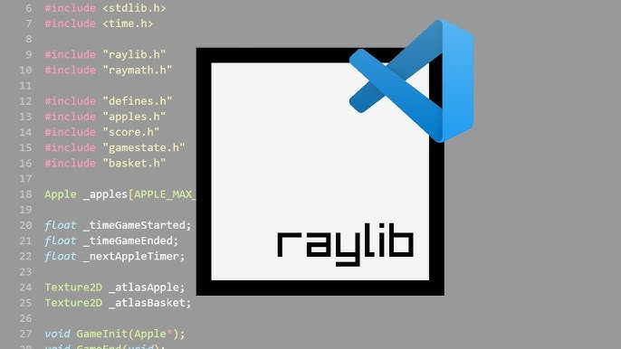
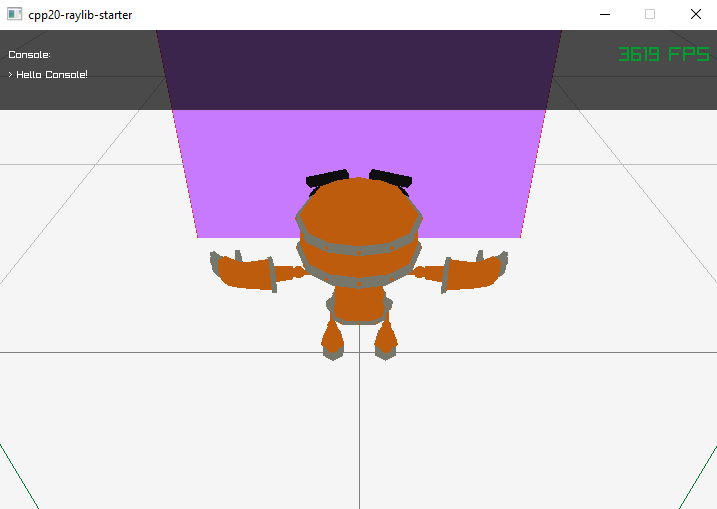
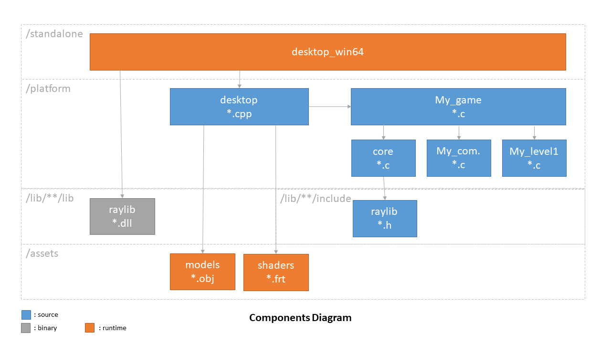

:warning: WORK IN PROGRESS
==========================

# C++ 2020 - RayLib - Starter

<p align="center">
  
</p>

## Content

  - [Content](#content)
  - [Features](#features)
  - [Dependencies](#dependencies)
  - [Screenshots](#screenshots)
  - [Install](#install)
  - [Usage](#usage)
  - [Resources](#resources)

---------------------------------------

## Features

- Stack
  - :heavy_check_mark: C++20
  - :heavy_check_mark: Standard libraries
  - :heavy_check_mark: Raylib
- Targets:
  - :heavy_check_mark: Win64 (Windows)
  - :x: JS (Javascript)
  - :x: WASM (WebAssembly)
- Graphics
  - :hourglass: Render: 
      :heavy_check_mark: PostProcessing
  - :hourglass: Camera: 
      :x: ThirdPerson
      :x: FOV
      :x: Cinematic
      :x: Dynamic res.
  - :x: Lighting:
      :x: Real Time
      :x: Backed
  - :hourglass: Meshes: 
      :heavy_check_mark: Meshes
      :heavy_check_mark: Textures
      :heavy_check_mark: Shaders
      :heavy_check_mark: Materials
      :x: LOD
  - :x: Visual Effects:
      :x: Particles
      :x: Distant Horizon
  - :x: Sky:
      :x: Color
      :x: Cubemap
      :x: Procedural
- World
  - :x: Terrain
      :x: Heightmap
      :x: SpeedTree
  - :x: Physics
      :x: hitbox
      :x: gravity
  - :x: Simulation
      :x: LevelTick
      :x: Water
      :x: Cloth
  - :x: Voxel
      :x: Octree
      :x: GeoMod
- Scripting
  - :x: Properties
  - :x: Bot
  - :x: LUA scripts
- Animation
  - :x: Character
  - :x: IK
- Audio: 
  - :x: Sound:
      :x: Wave
      :x: Spatial
  - :x: Music:
      :x: Player
      :x: Wave
      :x: Mp3
      :x: Module
- Input
  - :x: UI: 
      :x: start menu
      :x: quit menu
      :x: config menu
      :x: i18n
  - :x: Control:
      :x: Keyboard
      :x: Gamepad

## Dependencies

- [RayLib 4.0.0](https://www.raylib.com/)

## Screenshots





Repository layout:
```
├── assets
│   ├── i18n
│   └── images
│   └── ...
├── docs
├── infra
├── lib
│   ├── raylib-4.0.0-win64
│   ├── winmm-10-win64
├── platform
│   ├── core
│   └── desktop
├── standalone
│   ├── desktop_win64
│   ├── desktop_wasm
└── tools
```

## Install

### Windows

CMake:
- Download the `v3.28.3` release of `CMake` at http://www.cmake.org/download/.
- Pick Windows (`Windows x64 Installer`).
- Run the installer
- When asked for, select `Add CMake to the system PATH for all users`.
- Run software installation...

Visual Studio:
- Download the `Community` version of `Visual Studio 2022` release of Visual Studio at https://visualstudio.microsoft.com/downloads/
- Run the installer...
- Run software `Visual Studio Installer`
- When asked for, click on `modify` under `Visual Studio 2002`
- Select `Desktop development with C++` (contains MVC package)
- Click on `modify`

PowerShell:
```powershell
cmake -S "." -B "build" -G "Visual Studio 17 2022"
```

VS Code:

.vscode/c_cpp_properties.json:
```json
{
    "configurations": [
        {
            "name": "Win32",
            "includePath": [
                "${workspaceFolder}/**",
                "${workspaceFolder}/platform/core/include",
                "${workspaceFolder}/platform/desktop/include"
            ],
            "defines": [
                "_DEBUG",
                "UNICODE",
                "_UNICODE"
            ],
            "windowsSdkVersion": "10.0.22621.0",
            "compilerPath": "cl.exe",
            "cStandard": "c17",
            "cppStandard": "c++20",
            "intelliSenseMode": "windows-msvc-x64"
        }
    ],
    "version": 4
}
```

## Usage

### Dev

```powershell
# Init: Build
cmake -S "." -B "build"
cmake --build build

# Dev: Build & Run
cmake --build build | .\build\desktop_win64\Debug\desktop_win64.exe
```

### Release

```powershell
# Build
cmake -S "." -B "build"
cmake --build build --config Release

# Run
.\build\desktop_win64\Release\desktop_win64.exe
```

## Resources

- C
  - [ModernCppStarter](https://github.com/TheLartians/ModernCppStarter/tree/master)
  - [CMake with include and source paths - basic setup](https://stackoverflow.com/questions/8304190/cmake-with-include-and-source-paths-basic-setup)
- Monorepo
  - [How to structure a monorepo](https://lucapette.me/writing/how-to-structure-a-monorepo/?utm_source=atom_feed)
  - [A monorepo template that actually works](https://levelup.gitconnected.com/a-monorepo-template-that-actually-works-3efd87770fa5)
- Raylib
  - Examples
    - [GitHub](https://github.com/raysan5/raylib/blob/master/examples/)
    - [Demos](https://www.raylib.com/examples.html)
      - [shaders_postprocessing](https://www.raylib.com/examples/shaders/loader.html?name=shaders_postprocessing) 
